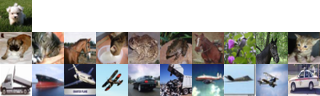

# Deep-INFOMAX
This is a pytorch implementation of Deep-INFOMAX.

original paper : [Learning deep representations by mutual information estimation and maximization.](https://arxiv.org/abs/1808.06670)

## reference github repositories

1. [DuaneNielsen/DeepInfomaxPytorch](https://github.com/DuaneNielsen/DeepInfomaxPytorch)
> pytorch. model definition and training script only without clustering example. our code is mainly based on this repository. Thanks!

2. [rcalland/deep-INFOMAX](https://github.com/rcalland/deep-INFOMAX)
> chainer. model definition and traning script with (knn?) clustering example on CIFAR10. Better documentation.

## related blogs and articles

1. [深度学习中的互信息：无监督提取特征](https://www.jiqizhixin.com/articles/2018-10-12-11)
> instead Adversarial training, this blog implements gaussian distribution as prior (similar to VAE). worth a try.

## sample result

after training 100 epochs with `Adam(lr=1e-4)`, we see that the encoder is able to distinguish "animals" and non-living things. (among 100 test images)
> top row : selected image; middle row : top 10 images with smallest L1 loss; bottom row : top 10 images with largest L1 loss.

